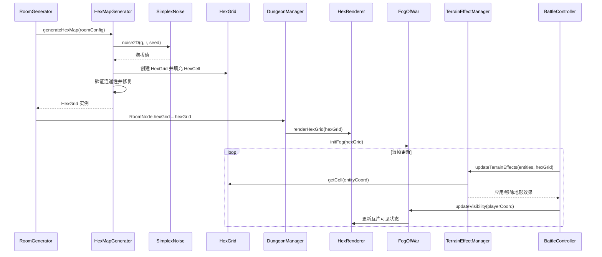
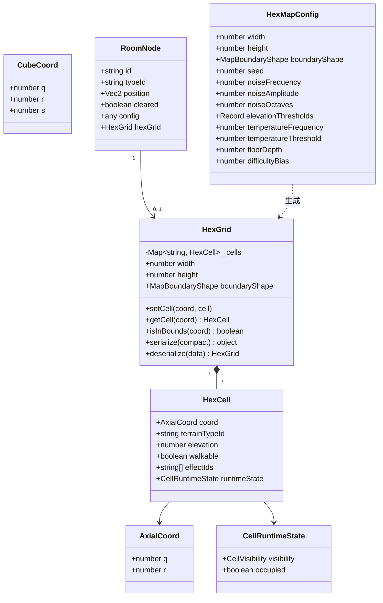

# 技术设计文档：六角格地形生成系统（Hex Terrain Generation）

## 概述

本文档描述六角格地形生成系统的技术设计方案。该系统为现有 RoguelikeGame 模块新增六角格（Hex Grid）地形能力，替代矩形房间内部的平面战斗区域，为每个房间生成具有多样化地形效果的六角格地图。

设计遵循项目现有的三层架构（框架层 → 引擎层 → 游戏层），复用 Extensible_System 可扩展架构（TypeRegistry + TypeFactory + Type_Config + Base_Interface），并与现有的 RoomGenerator、DungeonManager、BattleController 等系统无缝集成。

核心技术选型：
- **坐标系统**：采用轴向坐标 (q, r) 作为主存储格式，立方坐标 (q, r, s) 用于距离计算和寻路，参考 [Red Blob Games 六角格指南](https://www.redblobgames.com/grids/hexagons/)
- **噪声算法**：内置 Simplex Noise 实现（纯 TypeScript，无外部依赖），支持种子控制和多层叠加
- **寻路算法**：基于六角格的 A* 寻路，路径代价考虑地形移动速度修正
- **渲染策略**：视野范围内按需渲染，使用框架层 ObjectPool 管理瓦片节点

## 架构

### 整体分层

六角格地形系统作为 RoguelikeGame 模块的子系统，不引入新的框架层或引擎层模块，完全在游戏层内实现：

```
┌─────────────────────────────────────────────────────────┐
│                    游戏层 (Game)                          │
│  ┌────────────────────────────────────────────────────┐  │
│  │              RoguelikeGame 模块                      │  │
│  │  ┌──────────────────────────────────────────────┐  │  │
│  │  │         HexTerrain 子系统（新增）               │  │  │
│  │  │  HexCoordinate · HexGrid · HexMapGenerator   │  │  │
│  │  │  HexPathfinder · HexRenderer · FogOfWar      │  │  │
│  │  │  IHexTerrainType · ITerrainEffect            │  │  │
│  │  └──────────────────────────────────────────────┘  │  │
│  │  RoomGenerator ← 集成 HexMapGenerator              │  │
│  │  DungeonManager · BattleController · ...           │  │
│  └────────────────────────────────────────────────────┘  │
├─────────────────────────────────────────────────────────┤
│                   引擎层 (Engine)                         │
│  GameManager · UIManager · ResManager · ConfigManager    │
├─────────────────────────────────────────────────────────┤
│                  框架层 (Framework)                        │
│  EventManager · ObjectPool · TypeRegistry · TypeFactory  │
└─────────────────────────────────────────────────────────┘
```

### 模块目录结构

```
assets/scripts/Game/RoguelikeGame/
├── Data/
│   └── Interfaces/
│       ├── IHexTerrainType.ts       # 地形类型基类接口（新增）
│       └── ITerrainEffect.ts        # 地形效果基类接口（新增）
├── Runtime/
│   ├── HexTerrain/                  # 六角格地形子系统（新增）
│   │   ├── HexCoordinate.ts         # 坐标系统与转换器
│   │   ├── HexGrid.ts              # 六角格网格数据结构
│   │   ├── HexMapGenerator.ts      # 程序化地形生成器
│   │   ├── SimplexNoise.ts         # Simplex Noise 实现
│   │   ├── HexPathfinder.ts        # A* 寻路器
│   │   ├── HexRenderer.ts          # 六角格渲染器
│   │   ├── FogOfWar.ts             # 战争迷雾系统
│   │   └── TerrainEffectManager.ts # 地形效果管理器
│   ├── RoomGenerator.ts            # 已有，扩展集成 HexMapGenerator
│   └── DungeonManager.ts           # 已有，扩展传递 HexGrid 数据
├── Types/
│   ├── Terrains/                    # 地形类型实现（新增）
│   │   ├── PlainsTerrain.ts
│   │   ├── ForestTerrain.ts
│   │   ├── MountainTerrain.ts
│   │   ├── WaterTerrain.ts
│   │   ├── DesertTerrain.ts
│   │   └── SwampTerrain.ts
│   └── TerrainEffects/              # 地形效果实现（新增）
│       ├── SpeedModifierEffect.ts
│       ├── DefenseBoostEffect.ts
│       ├── DotDamageEffect.ts
│       ├── CooldownReductionEffect.ts
│       └── EvasionBoostEffect.ts
└── ...
```

### 系统交互流程



## 组件与接口

### 3.1 HexCoordinate — 坐标系统

纯逻辑模块，不依赖 Cocos Creator API。提供六角格坐标的表示、转换和计算。

```typescript
// Runtime/HexTerrain/HexCoordinate.ts

/** 轴向坐标 (q, r) */
export interface AxialCoord {
    q: number;
    r: number;
}

/** 立方坐标 (q, r, s)，满足 q + r + s = 0 */
export interface CubeCoord {
    q: number;
    r: number;
    s: number;
}

/** 像素坐标 */
export interface PixelCoord {
    x: number;
    y: number;
}

/** 六角格朝向 */
export enum HexOrientation {
    FlatTop = 0,   // 平顶六角格
    PointyTop = 1, // 尖顶六角格
}

/** 六角格布局参数 */
export interface HexLayout {
    orientation: HexOrientation;
    size: number;       // 六角格外接圆半径
    origin: PixelCoord; // 网格原点的像素偏移
}

/**
 * 六角格坐标转换器
 * 提供轴向坐标、立方坐标和像素坐标之间的转换，
 * 以及距离计算、邻居查询和范围查询等工具方法。
 */
export class HexCoordinate {

    // ─── 坐标转换 ───────────────────────────────────

    /** 轴向坐标 → 立方坐标 */
    static axialToCube(axial: AxialCoord): CubeCoord {
        return { q: axial.q, r: axial.r, s: -axial.q - axial.r };
    }

    /** 立方坐标 → 轴向坐标 */
    static cubeToAxial(cube: CubeCoord): AxialCoord {
        return { q: cube.q, r: cube.r };
    }

    /** 轴向坐标 → 像素坐标 */
    static axialToPixel(axial: AxialCoord, layout: HexLayout): PixelCoord {
        const { q, r } = axial;
        const size = layout.size;
        let x: number, y: number;

        if (layout.orientation === HexOrientation.FlatTop) {
            x = size * (3 / 2 * q);
            y = size * (Math.sqrt(3) / 2 * q + Math.sqrt(3) * r);
        } else {
            x = size * (Math.sqrt(3) * q + Math.sqrt(3) / 2 * r);
            y = size * (3 / 2 * r);
        }

        return { x: x + layout.origin.x, y: y + layout.origin.y };
    }

    /** 像素坐标 → 轴向坐标（取最近的六角格） */
    static pixelToAxial(pixel: PixelCoord, layout: HexLayout): AxialCoord {
        const px = pixel.x - layout.origin.x;
        const py = pixel.y - layout.origin.y;
        const size = layout.size;
        let q: number, r: number;

        if (layout.orientation === HexOrientation.FlatTop) {
            q = (2 / 3 * px) / size;
            r = (-1 / 3 * px + Math.sqrt(3) / 3 * py) / size;
        } else {
            q = (Math.sqrt(3) / 3 * px - 1 / 3 * py) / size;
            r = (2 / 3 * py) / size;
        }

        return HexCoordinate.cubeRound({ q, r, s: -q - r });
    }

    /** 立方坐标四舍五入（浮点 → 整数坐标） */
    static cubeRound(cube: CubeCoord): AxialCoord {
        let rq = Math.round(cube.q);
        let rr = Math.round(cube.r);
        let rs = Math.round(cube.s);

        const dq = Math.abs(rq - cube.q);
        const dr = Math.abs(rr - cube.r);
        const ds = Math.abs(rs - cube.s);

        if (dq > dr && dq > ds) {
            rq = -rr - rs;
        } else if (dr > ds) {
            rr = -rq - rs;
        } else {
            rs = -rq - rr;
        }

        return { q: rq, r: rr };
    }

    // ─── 距离与邻居 ─────────────────────────────────

    /** 计算两个六角格之间的距离（立方坐标曼哈顿距离） */
    static distance(a: AxialCoord, b: AxialCoord): number {
        const ac = HexCoordinate.axialToCube(a);
        const bc = HexCoordinate.axialToCube(b);
        return Math.max(
            Math.abs(ac.q - bc.q),
            Math.abs(ac.r - bc.r),
            Math.abs(ac.s - bc.s)
        );
    }

    /** 六个方向的偏移量（轴向坐标） */
    static readonly DIRECTIONS: ReadonlyArray<AxialCoord> = [
        { q: 1, r: 0 },  { q: 1, r: -1 }, { q: 0, r: -1 },
        { q: -1, r: 0 }, { q: -1, r: 1 }, { q: 0, r: 1 },
    ];

    /** 获取指定格子的 6 个相邻格子坐标 */
    static neighbors(center: AxialCoord): AxialCoord[] {
        return HexCoordinate.DIRECTIONS.map(d => ({
            q: center.q + d.q,
            r: center.r + d.r,
        }));
    }

    /** 获取指定格子在指定半径范围内的所有格子坐标 */
    static range(center: AxialCoord, radius: number): AxialCoord[] {
        const results: AxialCoord[] = [];
        for (let q = -radius; q <= radius; q++) {
            for (let r = Math.max(-radius, -q - radius);
                 r <= Math.min(radius, -q + radius); r++) {
                results.push({ q: center.q + q, r: center.r + r });
            }
        }
        return results;
    }

    // ─── 工具方法 ────────────────────────────────────

    /** 坐标相等判断 */
    static equals(a: AxialCoord, b: AxialCoord): boolean {
        return a.q === b.q && a.r === b.r;
    }

    /** 生成坐标的字符串键（用于 Map 存储） */
    static toKey(coord: AxialCoord): string {
        return `${coord.q},${coord.r}`;
    }

    /** 从字符串键解析坐标 */
    static fromKey(key: string): AxialCoord {
        const [q, r] = key.split(',').map(Number);
        return { q, r };
    }
}
```

### 3.2 HexGrid — 六角格网格数据结构

```typescript
// Runtime/HexTerrain/HexGrid.ts

import { AxialCoord, HexCoordinate } from './HexCoordinate';

/** 六角格单元 */
export interface HexCell {
    /** 轴向坐标 */
    coord: AxialCoord;
    /** 地形类型标识符（对应 TypeRegistry 中的 typeId） */
    terrainTypeId: string;
    /** 海拔值（0.0 ~ 1.0） */
    elevation: number;
    /** 是否可通行 */
    walkable: boolean;
    /** 地形效果标识符列表 */
    effectIds: string[];
    /** 运行时状态 */
    runtimeState: CellRuntimeState;
}

/** 格子运行时状态 */
export interface CellRuntimeState {
    /** 迷雾可见状态 */
    visibility: CellVisibility;
    /** 是否有实体占据 */
    occupied: boolean;
}

/** 格子可见状态 */
export enum CellVisibility {
    Unexplored = 0,  // 未探索（完全遮罩）
    Explored = 1,    // 已探索但不在视野内（半透明遮罩）
    Visible = 2,     // 当前视野内（完全可见）
}

/** 地图边界形状 */
export enum MapBoundaryShape {
    Rectangle = 0,
    Hexagon = 1,
    Rhombus = 2,
}

/**
 * 六角格网格
 * 使用 Map<string, HexCell> 存储，键为 "q,r" 格式的坐标字符串
 */
export class HexGrid {
    private _cells: Map<string, HexCell> = new Map();
    private _width: number;
    private _height: number;
    private _boundaryShape: MapBoundaryShape;

    constructor(width: number, height: number,
                boundaryShape: MapBoundaryShape = MapBoundaryShape.Rectangle) {
        this._width = width;
        this._height = height;
        this._boundaryShape = boundaryShape;
    }

    get width(): number { return this._width; }
    get height(): number { return this._height; }
    get boundaryShape(): MapBoundaryShape { return this._boundaryShape; }
    get cellCount(): number { return this._cells.size; }

    /** 设置格子数据 */
    setCell(coord: AxialCoord, cell: HexCell): void {
        this._cells.set(HexCoordinate.toKey(coord), cell);
    }

    /** 按坐标查询格子，不存在时返回 null */
    getCell(coord: AxialCoord): HexCell | null {
        return this._cells.get(HexCoordinate.toKey(coord)) ?? null;
    }

    /** 检查坐标是否在地图边界内 */
    isInBounds(coord: AxialCoord): boolean {
        return this._cells.has(HexCoordinate.toKey(coord));
    }

    /** 遍历所有格子 */
    forEach(callback: (cell: HexCell, key: string) => void): void {
        this._cells.forEach(callback);
    }

    /** 获取所有格子的迭代器 */
    cells(): IterableIterator<HexCell> {
        return this._cells.values();
    }

    /** 获取所有可通行的邻居格子 */
    getWalkableNeighbors(coord: AxialCoord): HexCell[] {
        return HexCoordinate.neighbors(coord)
            .map(n => this.getCell(n))
            .filter((c): c is HexCell => c !== null && c.walkable);
    }

    // ─── 序列化 ─────────────────────────────────────

    /** 序列化为 JSON 对象 */
    serialize(compact: boolean = false): object {
        const cells: any[] = [];
        for (const cell of this._cells.values()) {
            if (compact) {
                const entry: any = {
                    q: cell.coord.q, r: cell.coord.r,
                    t: cell.terrainTypeId,
                };
                if (cell.elevation !== 0) entry.e = cell.elevation;
                if (!cell.walkable) entry.w = false;
                if (cell.effectIds.length > 0) entry.fx = cell.effectIds;
                if (cell.runtimeState.visibility !== CellVisibility.Unexplored) {
                    entry.v = cell.runtimeState.visibility;
                }
                cells.push(entry);
            } else {
                cells.push({
                    coord: cell.coord,
                    terrainTypeId: cell.terrainTypeId,
                    elevation: cell.elevation,
                    walkable: cell.walkable,
                    effectIds: cell.effectIds,
                    runtimeState: cell.runtimeState,
                });
            }
        }
        return {
            width: this._width,
            height: this._height,
            boundaryShape: this._boundaryShape,
            cells,
        };
    }

    /** 从 JSON 对象反序列化，数据不合法时返回错误信息 */
    static deserialize(data: any): HexGrid | { error: string } {
        if (!data || typeof data !== 'object') {
            return { error: '输入数据不是有效对象' };
        }
        if (typeof data.width !== 'number' || typeof data.height !== 'number') {
            return { error: '缺少 width 或 height 字段' };
        }
        if (!Array.isArray(data.cells)) {
            return { error: '缺少 cells 数组字段' };
        }

        const grid = new HexGrid(data.width, data.height,
            data.boundaryShape ?? MapBoundaryShape.Rectangle);

        for (let i = 0; i < data.cells.length; i++) {
            const entry = data.cells[i];
            const coord: AxialCoord = entry.coord ?? { q: entry.q, r: entry.r };

            if (typeof coord.q !== 'number' || typeof coord.r !== 'number') {
                return { error: `cells[${i}] 坐标数据不合法` };
            }

            const terrainTypeId = entry.terrainTypeId ?? entry.t;
            if (typeof terrainTypeId !== 'string') {
                return { error: `cells[${i}] 缺少地形类型标识符` };
            }

            const cell: HexCell = {
                coord,
                terrainTypeId,
                elevation: entry.elevation ?? entry.e ?? 0,
                walkable: entry.walkable ?? entry.w ?? true,
                effectIds: entry.effectIds ?? entry.fx ?? [],
                runtimeState: entry.runtimeState ?? {
                    visibility: entry.v ?? CellVisibility.Unexplored,
                    occupied: false,
                },
            };
            grid.setCell(coord, cell);
        }

        return grid;
    }
}
```

### 3.3 IHexTerrainType — 地形类型接口

遵循现有 Extensible_System 架构，与 IRoomType、IEnemyType 等接口保持一致的设计模式。

```typescript
// Data/Interfaces/IHexTerrainType.ts

/**
 * 地形类型接口
 * 所有地形类型必须实现此接口，通过 TypeRegistry<IHexTerrainType> 注册
 */
export interface IHexTerrainType {
    /** 类型标识符，如 'plains', 'forest', 'mountain' */
    typeId: string;
    /** 显示名称 */
    displayName: string;
    /** 移动速度修正系数（1.0 为基准） */
    moveSpeedModifier: number;
    /** 是否可通行 */
    walkable: boolean;
    /** 关联的地形效果标识符列表 */
    effectIds: string[];
    /** 视觉资源路径（纹理或颜色标识） */
    visualAsset: string;
    /** 获取默认配置 */
    getDefaultConfig(): HexTerrainConfig;
}

/** 地形类型配置数据（对应 Type_Config） */
export interface HexTerrainConfig {
    typeId: string;
    displayName: string;
    moveSpeedModifier: number;
    walkable: boolean;
    effectIds: string[];
    visualAsset: string;
    /** 海拔阈值范围 [min, max)，用于噪声映射 */
    elevationRange?: [number, number];
}
```

### 3.4 ITerrainEffect — 地形效果接口

```typescript
// Data/Interfaces/ITerrainEffect.ts

/**
 * 地形效果接口
 * 所有地形效果必须实现此接口，通过 TypeRegistry<ITerrainEffect> 注册
 */
export interface ITerrainEffect {
    /** 效果标识符 */
    typeId: string;
    /** 效果显示名称 */
    displayName: string;
    /**
     * 应用效果到目标实体
     * @param target 目标实体的可修改属性
     */
    apply(target: TerrainEffectTarget): void;
    /**
     * 移除效果
     * @param target 目标实体的可修改属性
     */
    remove(target: TerrainEffectTarget): void;
    /**
     * 每帧更新（用于持续性效果如 DoT 伤害）
     * @param dt 帧间隔时间（秒）
     * @param target 目标实体
     */
    update(dt: number, target: TerrainEffectTarget): void;
}

/**
 * 地形效果目标接口
 * 描述可被地形效果作用的实体所需的最小属性集
 * 与现有 PlayerRuntimeState 和 EnemyAttributes 兼容
 */
export interface TerrainEffectTarget {
    /** 当前生命值 */
    hp: number;
    /** 最大生命值 */
    maxHp: number;
    /** 攻击力 */
    attack: number;
    /** 防御力 */
    defense: number;
    /** 移动速度 */
    moveSpeed: number;
    /** 基础移动速度（未修正前的值） */
    baseMoveSpeed: number;
    /** 技能冷却修正系数（1.0 为基准） */
    cooldownModifier: number;
    /** 闪避率修正 */
    evasionModifier: number;
}
```

### 3.5 SimplexNoise — 噪声生成器

```typescript
// Runtime/HexTerrain/SimplexNoise.ts

/**
 * Simplex Noise 实现
 * 纯 TypeScript，无外部依赖，支持种子控制
 * 用于程序化地形生成的连续伪随机噪声
 */
export class SimplexNoise {
    private _perm: Uint8Array;

    /**
     * @param seed 随机种子，相同种子产生相同噪声序列
     */
    constructor(seed: number) {
        this._perm = this._buildPermutationTable(seed);
    }

    /**
     * 2D Simplex Noise
     * @param x X 坐标
     * @param y Y 坐标
     * @returns 噪声值，范围 [-1, 1]
     */
    noise2D(x: number, y: number): number {
        // Simplex Noise 2D 标准实现
        // 使用 skew/unskew 变换将输入映射到简单三角网格
        // 返回 [-1, 1] 范围的连续噪声值
        // ... 完整实现省略，参考 Stefan Gustavson 的 Simplex Noise 论文
    }

    /**
     * 多层叠加噪声（Fractal Brownian Motion）
     * @param x X 坐标
     * @param y Y 坐标
     * @param octaves 叠加层数
     * @param frequency 基础频率
     * @param amplitude 基础振幅
     * @param lacunarity 频率倍增系数（默认 2.0）
     * @param persistence 振幅衰减系数（默认 0.5）
     * @returns 叠加后的噪声值，归一化到 [0, 1]
     */
    fbm(x: number, y: number, octaves: number,
        frequency: number, amplitude: number,
        lacunarity: number = 2.0, persistence: number = 0.5): number {
        let value = 0;
        let maxValue = 0;
        let freq = frequency;
        let amp = amplitude;

        for (let i = 0; i < octaves; i++) {
            value += this.noise2D(x * freq, y * freq) * amp;
            maxValue += amp;
            freq *= lacunarity;
            amp *= persistence;
        }

        // 归一化到 [0, 1]
        return (value / maxValue + 1) / 2;
    }

    private _buildPermutationTable(seed: number): Uint8Array {
        // 使用种子生成确定性排列表
        // ... 实现省略
    }
}
```

### 3.6 HexMapGenerator — 程序化地形生成器

```typescript
// Runtime/HexTerrain/HexMapGenerator.ts

import { TypeRegistry } from '../../../../framework/TypeRegistry';
import { IHexTerrainType } from '../../Data/Interfaces/IHexTerrainType';
import { HexGrid, HexCell, CellVisibility, MapBoundaryShape } from './HexGrid';
import { AxialCoord, HexCoordinate } from './HexCoordinate';
import { SimplexNoise } from './SimplexNoise';

/** 地图生成配置 */
export interface HexMapConfig {
    /** 地图宽度（格子数） */
    width: number;
    /** 地图高度（格子数） */
    height: number;
    /** 地图边界形状 */
    boundaryShape: MapBoundaryShape;
    /** 随机种子 */
    seed: number;
    /** 噪声基础频率 */
    noiseFrequency: number;
    /** 噪声基础振幅 */
    noiseAmplitude: number;
    /** 噪声叠加层数 */
    noiseOctaves: number;
    /** 地形海拔阈值映射：terrainTypeId → [minElevation, maxElevation) */
    elevationThresholds: Record<string, [number, number]>;
    /** 温度噪声频率（用于沙漠判定） */
    temperatureFrequency: number;
    /** 温度阈值（高于此值的平原区域转为沙漠） */
    temperatureThreshold: number;
    /** 楼层深度（影响地形分布） */
    floorDepth: number;
    /** 楼层难度曲线：每层增加的山地/沼泽比例偏移 */
    difficultyBias: number;
}

/**
 * 六角格地图生成器
 * 使用 Simplex Noise 程序化生成六角格地形地图
 */
export class HexMapGenerator {
    private _terrainRegistry: TypeRegistry<IHexTerrainType>;

    constructor(terrainRegistry: TypeRegistry<IHexTerrainType>) {
        this._terrainRegistry = terrainRegistry;
    }

    /**
     * 生成六角格地图
     * @param config 地图生成配置
     * @returns 填充完成的 HexGrid 实例
     */
    generate(config: HexMapConfig): HexGrid {
        const grid = new HexGrid(config.width, config.height, config.boundaryShape);
        const noise = new SimplexNoise(config.seed);
        const tempNoise = new SimplexNoise(config.seed + 1);

        // 1. 生成边界内的所有坐标
        const coords = this._generateBoundaryCoords(config);

        // 2. 为每个坐标生成海拔值和地形类型
        for (const coord of coords) {
            const elevation = noise.fbm(
                coord.q, coord.r,
                config.noiseOctaves,
                config.noiseFrequency,
                config.noiseAmplitude
            );

            // 楼层深度偏移：更深楼层增加高海拔和低海拔比例
            const biasedElevation = this._applyDifficultyBias(
                elevation, config.floorDepth, config.difficultyBias
            );

            // 温度噪声（用于沙漠判定）
            const temperature = tempNoise.fbm(
                coord.q, coord.r, 2,
                config.temperatureFrequency, 1.0
            );

            const terrainTypeId = this._mapElevationToTerrain(
                biasedElevation, temperature, config
            );

            const terrainType = this._terrainRegistry.create(terrainTypeId);

            const cell: HexCell = {
                coord,
                terrainTypeId,
                elevation: biasedElevation,
                walkable: terrainType?.walkable ?? true,
                effectIds: terrainType?.effectIds ?? [],
                runtimeState: {
                    visibility: CellVisibility.Unexplored,
                    occupied: false,
                },
            };
            grid.setCell(coord, cell);
        }

        // 3. 验证并修复连通性
        this._ensureConnectivity(grid);

        return grid;
    }

    /** 根据地图边界形状生成所有有效坐标 */
    private _generateBoundaryCoords(config: HexMapConfig): AxialCoord[] {
        const coords: AxialCoord[] = [];
        const { width, height, boundaryShape } = config;

        switch (boundaryShape) {
            case MapBoundaryShape.Rectangle:
                for (let r = 0; r < height; r++) {
                    const rOffset = Math.floor(r / 2);
                    for (let q = -rOffset; q < width - rOffset; q++) {
                        coords.push({ q, r });
                    }
                }
                break;
            case MapBoundaryShape.Hexagon: {
                const radius = Math.floor(Math.min(width, height) / 2);
                coords.push(...HexCoordinate.range({ q: 0, r: 0 }, radius));
                break;
            }
            case MapBoundaryShape.Rhombus:
                for (let q = 0; q < width; q++) {
                    for (let r = 0; r < height; r++) {
                        coords.push({ q, r });
                    }
                }
                break;
        }
        return coords;
    }

    /** 根据海拔值和温度映射到地形类型 */
    private _mapElevationToTerrain(
        elevation: number, temperature: number, config: HexMapConfig
    ): string {
        // 优先检查沙漠条件：平原海拔范围 + 高温
        const plainsRange = config.elevationThresholds['plains'];
        if (plainsRange &&
            elevation >= plainsRange[0] && elevation < plainsRange[1] &&
            temperature > config.temperatureThreshold) {
            return 'desert';
        }

        // 按海拔阈值匹配地形类型
        for (const [typeId, [min, max]] of Object.entries(config.elevationThresholds)) {
            if (elevation >= min && elevation < max) {
                return typeId;
            }
        }

        return 'plains'; // 默认平原
    }

    /** 应用楼层难度偏移 */
    private _applyDifficultyBias(
        elevation: number, floorDepth: number, bias: number
    ): number {
        // 更深楼层将中间海拔向两端推移，增加极端地形比例
        const offset = floorDepth * bias;
        const centered = elevation - 0.5;
        const biased = centered * (1 + offset) + 0.5;
        return Math.max(0, Math.min(1, biased));
    }

    /**
     * 验证并修复地图连通性
     * 使用 BFS 检查所有可通行格子是否连通，
     * 不连通时将隔断格子转换为平原
     */
    private _ensureConnectivity(grid: HexGrid): void {
        // 找到第一个可通行格子作为起点
        let startCoord: AxialCoord | null = null;
        const walkableCoords: AxialCoord[] = [];

        grid.forEach(cell => {
            if (cell.walkable) {
                walkableCoords.push(cell.coord);
                if (!startCoord) startCoord = cell.coord;
            }
        });

        if (!startCoord || walkableCoords.length <= 1) return;

        // BFS 从起点遍历所有可达的可通行格子
        const visited = new Set<string>();
        const queue: AxialCoord[] = [startCoord];
        visited.add(HexCoordinate.toKey(startCoord));

        while (queue.length > 0) {
            const current = queue.shift()!;
            for (const neighbor of grid.getWalkableNeighbors(current)) {
                const key = HexCoordinate.toKey(neighbor.coord);
                if (!visited.has(key)) {
                    visited.add(key);
                    queue.push(neighbor.coord);
                }
            }
        }

        // 检查是否有不可达的可通行格子
        const unreachable = walkableCoords.filter(
            c => !visited.has(HexCoordinate.toKey(c))
        );

        if (unreachable.length === 0) return;

        // 修复：在已达区域和未达区域之间找到最短路径上的不可通行格子，转为平原
        for (const target of unreachable) {
            this._connectToMainland(grid, target, visited);
        }
    }

    /** 将孤立的可通行格子连接到主连通区域 */
    private _connectToMainland(
        grid: HexGrid, target: AxialCoord, mainlandKeys: Set<string>
    ): void {
        // 从 target 向外 BFS 扩展，直到碰到 mainland 中的格子
        // 沿途将不可通行格子转为平原
        const visited = new Set<string>();
        const queue: Array<{ coord: AxialCoord; path: AxialCoord[] }> = [
            { coord: target, path: [] }
        ];
        visited.add(HexCoordinate.toKey(target));

        while (queue.length > 0) {
            const { coord, path } = queue.shift()!;

            for (const neighborCoord of HexCoordinate.neighbors(coord)) {
                const key = HexCoordinate.toKey(neighborCoord);
                if (visited.has(key)) continue;
                visited.add(key);

                const cell = grid.getCell(neighborCoord);
                if (!cell) continue;

                const newPath = [...path, neighborCoord];

                if (mainlandKeys.has(key)) {
                    // 找到连接点，将路径上的不可通行格子转为平原
                    for (const pathCoord of newPath) {
                        const pathCell = grid.getCell(pathCoord);
                        if (pathCell && !pathCell.walkable) {
                            pathCell.terrainTypeId = 'plains';
                            pathCell.walkable = true;
                            pathCell.effectIds = [];
                            mainlandKeys.add(HexCoordinate.toKey(pathCoord));
                        }
                    }
                    return;
                }

                queue.push({ coord: neighborCoord, path: newPath });
            }
        }
    }
}
```

### 3.7 HexPathfinder — A* 寻路器

```typescript
// Runtime/HexTerrain/HexPathfinder.ts

import { AxialCoord, HexCoordinate } from './HexCoordinate';
import { HexGrid } from './HexGrid';
import { TypeRegistry } from '../../../../framework/TypeRegistry';
import { IHexTerrainType } from '../../Data/Interfaces/IHexTerrainType';

/** 寻路结果 */
export interface PathResult {
    /** 是否找到路径 */
    found: boolean;
    /** 路径坐标序列（从起点到终点，包含两端） */
    path: AxialCoord[];
    /** 路径总代价 */
    totalCost: number;
}

/**
 * 六角格 A* 寻路器
 * 路径代价 = 1 / moveSpeedModifier（移动速度越慢代价越高）
 * 不可通行格子不会出现在路径中
 */
export class HexPathfinder {
    private _terrainRegistry: TypeRegistry<IHexTerrainType>;

    constructor(terrainRegistry: TypeRegistry<IHexTerrainType>) {
        this._terrainRegistry = terrainRegistry;
    }

    /**
     * 在六角格网格上执行 A* 寻路
     * @param grid 六角格网格
     * @param start 起点坐标
     * @param goal 终点坐标
     * @returns 寻路结果
     */
    findPath(grid: HexGrid, start: AxialCoord, goal: AxialCoord): PathResult {
        if (!grid.isInBounds(start) || !grid.isInBounds(goal)) {
            return { found: false, path: [], totalCost: 0 };
        }

        const goalCell = grid.getCell(goal);
        if (!goalCell || !goalCell.walkable) {
            return { found: false, path: [], totalCost: 0 };
        }

        const startKey = HexCoordinate.toKey(start);
        const goalKey = HexCoordinate.toKey(goal);

        // A* 数据结构
        const openSet = new Map<string, number>(); // key → fScore
        const cameFrom = new Map<string, string>();
        const gScore = new Map<string, number>();

        gScore.set(startKey, 0);
        openSet.set(startKey, HexCoordinate.distance(start, goal));

        while (openSet.size > 0) {
            // 取 fScore 最小的节点
            let currentKey = '';
            let minF = Infinity;
            for (const [key, f] of openSet) {
                if (f < minF) {
                    minF = f;
                    currentKey = key;
                }
            }

            if (currentKey === goalKey) {
                return this._reconstructPath(cameFrom, gScore, currentKey);
            }

            openSet.delete(currentKey);
            const currentCoord = HexCoordinate.fromKey(currentKey);

            for (const neighbor of grid.getWalkableNeighbors(currentCoord)) {
                const neighborKey = HexCoordinate.toKey(neighbor.coord);

                // 移动代价 = 1 / moveSpeedModifier
                const terrain = this._terrainRegistry.create(neighbor.terrainTypeId);
                const moveCost = terrain
                    ? 1 / Math.max(0.01, terrain.moveSpeedModifier)
                    : 1;

                const tentativeG = (gScore.get(currentKey) ?? Infinity) + moveCost;

                if (tentativeG < (gScore.get(neighborKey) ?? Infinity)) {
                    cameFrom.set(neighborKey, currentKey);
                    gScore.set(neighborKey, tentativeG);
                    const fScore = tentativeG + HexCoordinate.distance(neighbor.coord, goal);
                    openSet.set(neighborKey, fScore);
                }
            }
        }

        // 未找到路径
        return { found: false, path: [], totalCost: 0 };
    }

    /** 从 cameFrom 映射重建路径 */
    private _reconstructPath(
        cameFrom: Map<string, string>,
        gScore: Map<string, number>,
        goalKey: string
    ): PathResult {
        const path: AxialCoord[] = [];
        let current = goalKey;

        while (current) {
            path.unshift(HexCoordinate.fromKey(current));
            current = cameFrom.get(current)!;
        }

        return {
            found: true,
            path,
            totalCost: gScore.get(goalKey) ?? 0,
        };
    }
}
```

### 3.8 TerrainEffectManager — 地形效果管理器

```typescript
// Runtime/HexTerrain/TerrainEffectManager.ts

import { TypeRegistry } from '../../../../framework/TypeRegistry';
import { ITerrainEffect, TerrainEffectTarget } from '../../Data/Interfaces/ITerrainEffect';
import { HexGrid } from './HexGrid';
import { AxialCoord, HexCoordinate } from './HexCoordinate';

/**
 * 地形效果管理器
 * 跟踪实体所在的六角格，当格子变化时自动移除旧效果、应用新效果
 */
export class TerrainEffectManager {
    private _effectRegistry: TypeRegistry<ITerrainEffect>;
    /** 实体 ID → 当前所在格子坐标键 */
    private _entityCells: Map<string, string> = new Map();
    /** 实体 ID → 当前生效的效果实例列表 */
    private _activeEffects: Map<string, ITerrainEffect[]> = new Map();

    constructor(effectRegistry: TypeRegistry<ITerrainEffect>) {
        this._effectRegistry = effectRegistry;
    }

    /**
     * 更新实体的地形效果
     * 当实体移动到新格子时，移除旧效果并应用新效果
     * @param entityId 实体唯一标识
     * @param currentCoord 实体当前所在的轴向坐标
     * @param target 实体的可修改属性
     * @param grid 当前六角格网格
     */
    updateEntityTerrain(
        entityId: string,
        currentCoord: AxialCoord,
        target: TerrainEffectTarget,
        grid: HexGrid
    ): void {
        const currentKey = HexCoordinate.toKey(currentCoord);
        const previousKey = this._entityCells.get(entityId);

        if (previousKey === currentKey) {
            // 格子未变化，仅更新持续性效果
            this._updateActiveEffects(entityId, 0, target);
            return;
        }

        // 格子发生变化
        // 1. 移除旧效果
        this._removeEffects(entityId, target);

        // 2. 应用新效果
        const cell = grid.getCell(currentCoord);
        if (cell) {
            const effects: ITerrainEffect[] = [];
            for (const effectId of cell.effectIds) {
                const effect = this._effectRegistry.create(effectId);
                if (effect) {
                    effect.apply(target);
                    effects.push(effect);
                }
            }
            this._activeEffects.set(entityId, effects);
        }

        this._entityCells.set(entityId, currentKey);
    }

    /**
     * 每帧更新持续性效果（如 DoT 伤害）
     */
    updateEffects(dt: number, entityId: string, target: TerrainEffectTarget): void {
        this._updateActiveEffects(entityId, dt, target);
    }

    /**
     * 移除实体的所有地形效果（实体离开地图或死亡时调用）
     */
    removeAllEffects(entityId: string, target: TerrainEffectTarget): void {
        this._removeEffects(entityId, target);
        this._entityCells.delete(entityId);
    }

    /** 清空所有跟踪数据 */
    clear(): void {
        this._entityCells.clear();
        this._activeEffects.clear();
    }

    private _removeEffects(entityId: string, target: TerrainEffectTarget): void {
        const effects = this._activeEffects.get(entityId);
        if (effects) {
            for (const effect of effects) {
                effect.remove(target);
            }
            this._activeEffects.delete(entityId);
        }
    }

    private _updateActiveEffects(
        entityId: string, dt: number, target: TerrainEffectTarget
    ): void {
        const effects = this._activeEffects.get(entityId);
        if (effects) {
            for (const effect of effects) {
                effect.update(dt, target);
            }
        }
    }
}
```

### 3.9 FogOfWar — 战争迷雾系统

```typescript
// Runtime/HexTerrain/FogOfWar.ts

import { HexGrid, CellVisibility } from './HexGrid';
import { AxialCoord, HexCoordinate } from './HexCoordinate';

/** 迷雾配置 */
export interface FogOfWarConfig {
    /** 基础视野半径（格子数） */
    baseViewRadius: number;
}

/**
 * 战争迷雾系统
 * 管理六角格地图的可见状态，根据玩家位置和地形类型动态更新视野
 */
export class FogOfWar {
    private _config: FogOfWarConfig;
    private _grid: HexGrid | null = null;
    /** 当前视野内的格子坐标键集合 */
    private _currentVisible: Set<string> = new Set();

    constructor(config: FogOfWarConfig) {
        this._config = config;
    }

    /**
     * 初始化迷雾，将所有格子设为未探索状态
     */
    init(grid: HexGrid): void {
        this._grid = grid;
        this._currentVisible.clear();
        grid.forEach(cell => {
            cell.runtimeState.visibility = CellVisibility.Unexplored;
        });
    }

    /**
     * 更新玩家视野
     * @param playerCoord 玩家当前所在的轴向坐标
     * @param viewRadiusModifier 视野半径修正值（森林 -1，山地 +1）
     * @returns 新揭开的格子坐标列表（用于通知渲染器）
     */
    updateVisibility(
        playerCoord: AxialCoord,
        viewRadiusModifier: number = 0
    ): AxialCoord[] {
        if (!this._grid) return [];

        const radius = Math.max(1, this._config.baseViewRadius + viewRadiusModifier);
        const newVisible = new Set<string>();
        const newlyRevealed: AxialCoord[] = [];

        // 计算新视野范围
        const visibleCoords = HexCoordinate.range(playerCoord, radius);
        for (const coord of visibleCoords) {
            const cell = this._grid.getCell(coord);
            if (!cell) continue;

            const key = HexCoordinate.toKey(coord);
            newVisible.add(key);

            if (cell.runtimeState.visibility !== CellVisibility.Visible) {
                if (cell.runtimeState.visibility === CellVisibility.Unexplored) {
                    newlyRevealed.push(coord);
                }
                cell.runtimeState.visibility = CellVisibility.Visible;
            }
        }

        // 将离开视野的格子设为已探索
        for (const prevKey of this._currentVisible) {
            if (!newVisible.has(prevKey)) {
                const coord = HexCoordinate.fromKey(prevKey);
                const cell = this._grid.getCell(coord);
                if (cell) {
                    cell.runtimeState.visibility = CellVisibility.Explored;
                }
            }
        }

        this._currentVisible = newVisible;
        return newlyRevealed;
    }

    /**
     * 获取指定格子的可见状态
     */
    getVisibility(coord: AxialCoord): CellVisibility {
        if (!this._grid) return CellVisibility.Unexplored;
        const cell = this._grid.getCell(coord);
        return cell?.runtimeState.visibility ?? CellVisibility.Unexplored;
    }
}
```

### 3.10 HexRenderer — 六角格渲染器

```typescript
// Runtime/HexTerrain/HexRenderer.ts

import { Node, Color } from 'cc';
import { ObjectPool } from '../../../../framework/ObjectPool';
import { HexGrid, HexCell, CellVisibility } from './HexGrid';
import { AxialCoord, HexCoordinate, HexLayout } from './HexCoordinate';

/**
 * 六角格渲染器
 * 负责将 HexGrid 数据渲染为 Cocos Creator 场景节点
 * 使用 ObjectPool 管理瓦片节点，仅渲染视野范围内的格子
 */
export class HexRenderer {
    private _rootNode: Node;
    private _tilePool: ObjectPool<Node>;
    private _layout: HexLayout;
    /** 当前已渲染的瓦片：坐标键 → 节点 */
    private _activeTiles: Map<string, Node> = new Map();
    /** 当前高亮的格子坐标键 */
    private _highlightedKey: string | null = null;

    constructor(rootNode: Node, tilePool: ObjectPool<Node>, layout: HexLayout) {
        this._rootNode = rootNode;
        this._tilePool = tilePool;
        this._layout = layout;
    }

    /**
     * 根据视野范围更新渲染
     * @param grid 六角格网格数据
     * @param centerCoord 视野中心坐标（通常为玩家位置）
     * @param viewRadius 视野半径
     */
    updateView(grid: HexGrid, centerCoord: AxialCoord, viewRadius: number): void {
        const visibleCoords = HexCoordinate.range(centerCoord, viewRadius);
        const newVisibleKeys = new Set<string>();

        for (const coord of visibleCoords) {
            const cell = grid.getCell(coord);
            if (!cell) continue;

            const key = HexCoordinate.toKey(coord);
            newVisibleKeys.add(key);

            if (!this._activeTiles.has(key)) {
                // 新进入视野的格子：从对象池获取节点并渲染
                const tileNode = this._tilePool.get();
                this._setupTileNode(tileNode, cell);
                this._rootNode.addChild(tileNode);
                this._activeTiles.set(key, tileNode);
            } else {
                // 已在视野内的格子：更新可见状态
                this._updateTileVisibility(this._activeTiles.get(key)!, cell);
            }
        }

        // 回收离开视野的瓦片节点
        for (const [key, node] of this._activeTiles) {
            if (!newVisibleKeys.has(key)) {
                node.removeFromParent();
                this._tilePool.put(node);
                this._activeTiles.delete(key);
            }
        }
    }

    /**
     * 高亮指定格子
     */
    highlightCell(coord: AxialCoord): void {
        // 取消之前的高亮
        if (this._highlightedKey) {
            const prevNode = this._activeTiles.get(this._highlightedKey);
            if (prevNode) this._setHighlight(prevNode, false);
        }

        const key = HexCoordinate.toKey(coord);
        const node = this._activeTiles.get(key);
        if (node) {
            this._setHighlight(node, true);
            this._highlightedKey = key;
        }
    }

    /** 清空所有渲染的瓦片 */
    clear(): void {
        for (const [, node] of this._activeTiles) {
            node.removeFromParent();
            this._tilePool.put(node);
        }
        this._activeTiles.clear();
        this._highlightedKey = null;
    }

    private _setupTileNode(node: Node, cell: HexCell): void {
        const pixel = HexCoordinate.axialToPixel(cell.coord, this._layout);
        node.setPosition(pixel.x, pixel.y, 0);
        this._applyTerrainVisual(node, cell.terrainTypeId);
        this._updateTileVisibility(node, cell);
        this._applyTerrainIcon(node, cell.terrainTypeId);
    }

    private _applyTerrainVisual(node: Node, terrainTypeId: string): void {
        // 根据地形类型设置颜色或纹理
        // 具体实现依赖资源加载策略
    }

    private _applyTerrainIcon(node: Node, terrainTypeId: string): void {
        // 在瓦片上显示地形类型图标
    }

    private _updateTileVisibility(node: Node, cell: HexCell): void {
        switch (cell.runtimeState.visibility) {
            case CellVisibility.Unexplored:
                node.active = false;
                break;
            case CellVisibility.Explored:
                node.active = true;
                // 设置半透明遮罩
                break;
            case CellVisibility.Visible:
                node.active = true;
                // 完全可见
                break;
        }
    }

    private _setHighlight(node: Node, highlighted: boolean): void {
        // 设置/取消高亮效果
    }
}
```

### 3.11 RoomGenerator 扩展 — 集成 HexMapGenerator

现有 `RoomGenerator` 需要扩展以在生成房间时同时生成六角格地图。

```typescript
// 扩展 RoomNode 接口（在 IRoomType.ts 中）
export interface RoomNode {
    id: string;
    typeId: string;
    position: Vec2;
    cleared: boolean;
    config: any;
    /** 新增：房间内部的六角格地图数据 */
    hexGrid?: HexGrid;
}

// RoomGenerator 扩展
export class RoomGenerator {
    private _roomRegistry: TypeRegistry<IRoomType>;
    private _hexMapGenerator: HexMapGenerator;  // 新增

    constructor(
        roomRegistry: TypeRegistry<IRoomType>,
        hexMapGenerator: HexMapGenerator         // 新增参数
    ) {
        this._roomRegistry = roomRegistry;
        this._hexMapGenerator = hexMapGenerator;
    }

    generateFloor(floorIndex: number, config: FloorConfig): DungeonFloor {
        // ... 现有逻辑不变 ...
        const rooms = this._generateRooms(typeDistribution);

        // 新增：为每个房间生成六角格地图
        for (const room of rooms) {
            const hexConfig = this._getHexMapConfig(room.typeId, floorIndex);
            room.hexGrid = this._hexMapGenerator.generate(hexConfig);
        }

        // ... 后续逻辑不变 ...
    }

    /** 根据房间类型获取对应的六角格地图配置 */
    private _getHexMapConfig(roomTypeId: string, floorIndex: number): HexMapConfig {
        // 不同房间类型使用不同的地图配置：
        // - battle: 开阔地形，较大地图，地形多样
        // - elite: 更多障碍地形，山地/水域比例增加
        // - boss: 竞技场风格，对称布局，六角形边界
        // 通过 ConfigManager 加载对应的 HexMapConfig
    }
}
```

### 3.12 TypeRegistration 扩展 — 注册地形类型和效果

```typescript
// 在 Types/TypeRegistration.ts 中新增

import { IHexTerrainType } from '../Data/Interfaces/IHexTerrainType';
import { ITerrainEffect } from '../Data/Interfaces/ITerrainEffect';

// 地形类型导入
import { PlainsTerrain } from './Terrains/PlainsTerrain';
import { ForestTerrain } from './Terrains/ForestTerrain';
import { MountainTerrain } from './Terrains/MountainTerrain';
import { WaterTerrain } from './Terrains/WaterTerrain';
import { DesertTerrain } from './Terrains/DesertTerrain';
import { SwampTerrain } from './Terrains/SwampTerrain';

// 地形效果导入
import { SpeedModifierEffect } from './TerrainEffects/SpeedModifierEffect';
import { DefenseBoostEffect } from './TerrainEffects/DefenseBoostEffect';
import { DotDamageEffect } from './TerrainEffects/DotDamageEffect';
import { CooldownReductionEffect } from './TerrainEffects/CooldownReductionEffect';
import { EvasionBoostEffect } from './TerrainEffects/EvasionBoostEffect';

/** 地形类型注册表 */
export const terrainRegistry = new TypeRegistry<IHexTerrainType>();

/** 地形效果注册表 */
export const terrainEffectRegistry = new TypeRegistry<ITerrainEffect>();

export function registerAllTypes(): void {
    // ... 现有注册逻辑不变 ...

    // 地形类型（新增）
    terrainRegistry.register('plains', () => new PlainsTerrain());
    terrainRegistry.register('forest', () => new ForestTerrain());
    terrainRegistry.register('mountain', () => new MountainTerrain());
    terrainRegistry.register('water', () => new WaterTerrain());
    terrainRegistry.register('desert', () => new DesertTerrain());
    terrainRegistry.register('swamp', () => new SwampTerrain());

    // 地形效果（新增）
    terrainEffectRegistry.register('speed_modifier', () => new SpeedModifierEffect());
    terrainEffectRegistry.register('defense_boost', () => new DefenseBoostEffect());
    terrainEffectRegistry.register('dot_damage', () => new DotDamageEffect());
    terrainEffectRegistry.register('cooldown_reduction', () => new CooldownReductionEffect());
    terrainEffectRegistry.register('evasion_boost', () => new EvasionBoostEffect());
}
```

## 数据模型

### 4.1 核心数据结构关系



### 4.2 地形配置数据结构

地形配置通过 ConfigManager 加载，支持 JSON 格式和 FlatBuffers 二进制格式。

```typescript
/** 地形类型配置表（对应 Excel 配置） */
interface TerrainTypeConfigTable {
    terrains: TerrainTypeConfigRow[];
}

interface TerrainTypeConfigRow {
    /** 地形标识符 */
    typeId: string;
    /** 显示名称 */
    displayName: string;
    /** 移动速度修正系数 */
    moveSpeedModifier: number;
    /** 是否可通行 */
    walkable: boolean;
    /** 关联的效果标识符列表 */
    effectIds: string[];
    /** 视觉资源路径 */
    visualAsset: string;
    /** 海拔阈值范围 */
    elevationMin: number;
    elevationMax: number;
}

/** 生态群落配置表 */
interface BiomeConfigTable {
    biomes: BiomeConfigRow[];
}

interface BiomeConfigRow {
    /** 生态群落标识符 */
    biomeId: string;
    /** 包含的地形类型及其权重 */
    terrainWeights: Record<string, number>;
    /** 出现的最小楼层 */
    minFloor: number;
    /** 出现的最大楼层（-1 表示无上限） */
    maxFloor: number;
}

/** 地图生成配置表（按房间类型） */
interface MapGenConfigTable {
    configs: MapGenConfigRow[];
}

interface MapGenConfigRow {
    /** 房间类型标识符 */
    roomTypeId: string;
    /** 地图宽度 */
    mapWidth: number;
    /** 地图高度 */
    mapHeight: number;
    /** 地图边界形状 */
    boundaryShape: number;
    /** 噪声频率 */
    noiseFrequency: number;
    /** 噪声振幅 */
    noiseAmplitude: number;
    /** 噪声叠加层数 */
    noiseOctaves: number;
    /** 温度噪声频率 */
    temperatureFrequency: number;
    /** 温度阈值 */
    temperatureThreshold: number;
    /** 楼层难度偏移系数 */
    difficultyBias: number;
}
```

### 4.3 默认地形参数

| 地形类型 | typeId | 移动速度修正 | 可通行 | 海拔范围 | 关联效果 |
|---------|--------|------------|--------|---------|---------|
| 平原 | plains | 1.0 | ✓ | [0.4, 0.6) | speed_modifier |
| 森林 | forest | 0.7 | ✓ | [0.6, 0.75) | speed_modifier, evasion_boost |
| 山地 | mountain | 0.4 | ✓ | [0.75, 0.9) | speed_modifier, defense_boost |
| 水域 | water | 0.0 | ✗ | [0.0, 0.3) | — |
| 沙漠 | desert | 0.8 | ✓ | 温度决定 | speed_modifier, cooldown_reduction |
| 沼泽 | swamp | 0.5 | ✓ | [0.3, 0.4) | speed_modifier, dot_damage |

### 4.4 默认地图生成参数（按房间类型）

| 房间类型 | 地图尺寸 | 边界形状 | 噪声频率 | 叠加层数 | 特点 |
|---------|---------|---------|---------|---------|------|
| battle | 15×15 | Rectangle | 0.08 | 3 | 开阔地形，平原为主 |
| elite | 12×12 | Rectangle | 0.12 | 4 | 更多障碍，山地/沼泽比例高 |
| boss | 18×18 | Hexagon | 0.05 | 2 | 竞技场风格，对称布局 |

## 正确性属性（Correctness Properties）

*属性（Property）是指在系统所有有效执行中都应成立的特征或行为——本质上是对系统应做什么的形式化陈述。属性是人类可读规格说明与机器可验证正确性保证之间的桥梁。*

### Property 1: 立方坐标约束不变量

*For any* 有效的轴向坐标 (q, r)，转换为立方坐标 (q, r, s) 后，SHALL 满足 q + r + s = 0。

**Validates: Requirements 1.2**

### Property 2: 轴向坐标 ↔ 立方坐标往返一致性

*For any* 有效的轴向坐标 (q, r)，先转换为立方坐标再转换回轴向坐标，SHALL 产生与原始坐标完全相同的结果。

**Validates: Requirements 1.8**

### Property 3: 轴向坐标 → 像素坐标 → 轴向坐标往返一致性

*For any* 有效的整数轴向坐标 (q, r) 和任意 HexLayout（包括 FlatTop 和 PointyTop 朝向），先转换为像素坐标再转换回轴向坐标，SHALL 产生与原始坐标完全相同的结果。

**Validates: Requirements 1.9**

### Property 4: 六角格距离对称性与非负性

*For any* 两个有效的轴向坐标 a 和 b，distance(a, b) SHALL 满足：(1) distance(a, b) >= 0，(2) distance(a, b) == distance(b, a)，(3) distance(a, a) == 0。

**Validates: Requirements 1.5**

### Property 5: 邻居数量与距离不变量

*For any* 有效的轴向坐标 center，neighbors(center) SHALL 返回恰好 6 个坐标，且每个返回的坐标与 center 的距离恰好为 1。

**Validates: Requirements 1.6**

### Property 6: 范围查询包含性

*For any* 有效的轴向坐标 center 和非负整数 radius，range(center, radius) 返回的所有坐标与 center 的距离 SHALL 不超过 radius，且距离不超过 radius 的所有坐标都 SHALL 被包含在结果中。

**Validates: Requirements 1.7**

### Property 7: 网格查询一致性

*For any* HexGrid 实例和任意轴向坐标 coord，isInBounds(coord) 返回 true 当且仅当 getCell(coord) 返回非 null 值。

**Validates: Requirements 2.3, 2.5**

### Property 8: HexGrid 序列化往返一致性

*For any* 有效的 HexGrid 实例（包含任意数量的 HexCell，使用任意边界形状），序列化为 JSON 后再反序列化，SHALL 产生与原始实例等价的 HexGrid（相同的 width、height、boundaryShape，以及所有 HexCell 的 coord、terrainTypeId、elevation、walkable、effectIds 和 runtimeState 均相同）。紧凑格式和完整格式均 SHALL 满足此属性。

**Validates: Requirements 2.7, 6.7, 10.4**

### Property 9: 地形效果属性修正

*For any* TerrainEffectTarget 和任意地形属性修正效果（evasion_boost、defense_boost、cooldown_reduction），apply() 后目标的对应属性 SHALL 发生预期方向的变化（闪避率增加、防御力增加、冷却系数降低），且 remove() 后 SHALL 恢复到 apply() 之前的值。

**Validates: Requirements 3.3, 3.4, 3.6**

### Property 10: 沼泽持续伤害

*For any* 具有正生命值的 TerrainEffectTarget，在沼泽 DoT 效果的 update(dt) 调用中（dt > 0），目标的 hp SHALL 减少。

**Validates: Requirements 3.5**

### Property 11: 确定性地形生成

*For any* 相同的种子值和 HexMapConfig 配置参数，HexMapGenerator.generate() 调用两次 SHALL 产生完全相同的 HexGrid（所有 HexCell 的 terrainTypeId 和 elevation 均相同）。

**Validates: Requirements 4.2, 4.9**

### Property 12: 噪声输出范围

*For any* 输入坐标 (x, y)、叠加层数 octaves ≥ 1、频率 frequency > 0 和振幅 amplitude > 0，SimplexNoise.fbm() 的输出 SHALL 在 [0, 1] 范围内。

**Validates: Requirements 4.4**

### Property 13: 海拔到地形类型映射正确性

*For any* 海拔值 elevation ∈ [0, 1] 和有效的 elevationThresholds 配置，_mapElevationToTerrain() SHALL 返回海拔值所在阈值范围对应的地形类型标识符。

**Validates: Requirements 4.3**

### Property 14: 可通行区域连通性

*For any* 由 HexMapGenerator.generate() 生成的 HexGrid，所有 walkable 为 true 的 HexCell SHALL 形成单个连通分量（从任意可通行格子出发，通过相邻的可通行格子可以到达所有其他可通行格子）。

**Validates: Requirements 4.5, 4.7**

### Property 15: 地形移动速度修正

*For any* 实体和任意可通行地形类型，TerrainEffectManager.updateEntityTerrain() 后实体的 moveSpeed SHALL 等于 baseMoveSpeed × 该地形的 moveSpeedModifier。

**Validates: Requirements 5.1, 5.2**

### Property 16: 地形效果切换

*For any* 实体从地形 A 的格子移动到地形 B 的格子，TerrainEffectManager.updateEntityTerrain() SHALL 移除地形 A 的所有效果并应用地形 B 的所有效果，使得实体上仅有地形 B 的效果处于激活状态。

**Validates: Requirements 5.3**

### Property 17: 寻路路径有效性

*For any* HexGrid、可通行的起点和终点坐标，若 HexPathfinder.findPath() 返回 found=true，则路径 SHALL 满足：(1) 路径中每个格子都是可通行的，(2) 路径中相邻两个坐标的六角格距离恰好为 1，(3) 路径的第一个坐标为起点、最后一个坐标为终点。

**Validates: Requirements 5.4, 5.5, 5.6**

### Property 18: 迷雾初始化

*For any* HexGrid 实例，FogOfWar.init() 调用后，网格中所有 HexCell 的 visibility SHALL 为 Unexplored。

**Validates: Requirements 8.1**

### Property 19: 迷雾可见性更新与状态转换

*For any* 已初始化迷雾的 HexGrid 和任意玩家坐标序列 [pos1, pos2]，在 updateVisibility(pos1) 后所有距离 pos1 不超过视野半径的格子 SHALL 为 Visible；在 updateVisibility(pos2) 后，仅在 pos1 视野内但不在 pos2 视野内的格子 SHALL 变为 Explored（而非回退到 Unexplored），pos2 视野内的格子 SHALL 为 Visible。

**Validates: Requirements 8.2, 8.3**

### Property 20: 地形配置数据序列化往返一致性

*For any* 有效的地形配置数据对象（TerrainTypeConfigRow），序列化为 JSON 后再反序列化 SHALL 产生与原始对象等价的结果。

**Validates: Requirements 9.4**

## 错误处理

### 6.1 坐标系统错误

| 场景 | 处理方式 |
|------|---------|
| pixelToAxial 接收到 NaN 或 Infinity | 返回 {q: 0, r: 0} 并输出 console.warn |
| fromKey 接收到格式不正确的字符串 | 返回 {q: 0, r: 0} 并输出 console.warn |
| range 接收到负数 radius | 返回空数组 |

### 6.2 网格数据错误

| 场景 | 处理方式 |
|------|---------|
| getCell 查询不存在的坐标 | 返回 null（需求 2.3） |
| deserialize 接收到 null 或非对象数据 | 返回 { error: '输入数据不是有效对象' } |
| deserialize 缺少 width/height 字段 | 返回 { error: '缺少 width 或 height 字段' } |
| deserialize 缺少 cells 数组 | 返回 { error: '缺少 cells 数组字段' } |
| deserialize 中某个 cell 坐标数据不合法 | 返回 { error: 'cells[i] 坐标数据不合法' } |
| deserialize 中某个 cell 缺少地形类型 | 返回 { error: 'cells[i] 缺少地形类型标识符' } |

### 6.3 地形生成错误

| 场景 | 处理方式 |
|------|---------|
| 噪声生成的海拔值不匹配任何阈值范围 | 默认映射为 'plains' |
| terrainRegistry 中未注册请求的地形类型 | 使用默认值（walkable=true, effectIds=[]），输出 console.warn |
| 生成的地图不连通 | 自动修复：将隔断格子转换为平原（需求 4.7） |
| HexMapConfig 中 width 或 height ≤ 0 | 使用最小值 1，输出 console.warn |

### 6.4 寻路错误

| 场景 | 处理方式 |
|------|---------|
| 起点或终点不在地图边界内 | 返回 { found: false, path: [], totalCost: 0 } |
| 终点不可通行 | 返回 { found: false, path: [], totalCost: 0 } |
| 起点到终点之间无可通行路径 | 返回 { found: false, path: [], totalCost: 0 }（需求 5.7） |
| 地形的 moveSpeedModifier 为 0 或负数 | 使用最小代价 1/0.01 = 100，避免除零 |

### 6.5 地形效果错误

| 场景 | 处理方式 |
|------|---------|
| effectRegistry 中未注册请求的效果类型 | 跳过该效果，输出 console.warn |
| 实体离开地图或死亡 | 调用 removeAllEffects 清除所有活跃效果 |
| 同一实体重复进入同一格子 | 不重复应用效果（通过坐标键比较） |

### 6.6 渲染错误

| 场景 | 处理方式 |
|------|---------|
| 对象池耗尽 | ObjectPool 自动创建新实例（factory 回调） |
| 瓦片节点回收失败 | 输出 console.warn，不阻塞渲染流程 |
| 地形类型无对应视觉资源 | 使用默认颜色/纹理作为 fallback |

### 6.7 迷雾系统错误

| 场景 | 处理方式 |
|------|---------|
| updateVisibility 在 init 之前调用 | 返回空数组，不修改任何状态 |
| 视野半径修正后 ≤ 0 | 使用最小值 1 |

## 测试策略

### 7.1 测试框架选型

- **单元测试框架**：Jest（TypeScript 项目标准选择）
- **属性测试框架**：fast-check（TypeScript 生态中最成熟的 PBT 库）
- 所有纯逻辑模块（HexCoordinate、HexGrid、SimplexNoise、HexMapGenerator、HexPathfinder、FogOfWar、TerrainEffectManager）均不依赖 Cocos Creator API，可直接在 Node.js 环境中测试

### 7.2 属性测试（Property-Based Testing）

使用 fast-check 实现设计文档中定义的 20 个正确性属性。每个属性测试：
- 最少运行 100 次迭代
- 使用注释标注对应的设计文档属性编号
- 标签格式：`Feature: hex-terrain-generation, Property {number}: {property_text}`

**属性测试覆盖范围：**

| 属性编号 | 测试目标 | 对应需求 |
|---------|---------|---------|
| Property 1 | 立方坐标约束 q+r+s=0 | 1.2 |
| Property 2 | Axial↔Cube 往返 | 1.8 |
| Property 3 | Axial→Pixel→Axial 往返 | 1.9 |
| Property 4 | 距离对称性与非负性 | 1.5 |
| Property 5 | 邻居数量与距离 | 1.6 |
| Property 6 | 范围查询包含性 | 1.7 |
| Property 7 | 网格查询一致性 | 2.3, 2.5 |
| Property 8 | HexGrid 序列化往返 | 2.7, 6.7, 10.4 |
| Property 9 | 地形效果属性修正 | 3.3, 3.4, 3.6 |
| Property 10 | 沼泽 DoT 伤害 | 3.5 |
| Property 11 | 确定性生成 | 4.2, 4.9 |
| Property 12 | 噪声输出范围 | 4.4 |
| Property 13 | 海拔→地形映射 | 4.3 |
| Property 14 | 可通行区域连通性 | 4.5, 4.7 |
| Property 15 | 移动速度修正 | 5.1, 5.2 |
| Property 16 | 效果切换 | 5.3 |
| Property 17 | 寻路路径有效性 | 5.4, 5.5, 5.6 |
| Property 18 | 迷雾初始化 | 8.1 |
| Property 19 | 迷雾可见性更新 | 8.2, 8.3 |
| Property 20 | 配置数据序列化往返 | 9.4 |

### 7.3 单元测试（Example-Based Testing）

单元测试聚焦于具体示例、边界条件和集成点：

**坐标系统：**
- 验证 FlatTop 和 PointyTop 两种朝向的像素坐标转换结果
- 验证 fromKey 解析格式不正确字符串的行为

**网格数据：**
- 验证三种边界形状（Rectangle、Hexagon、Rhombus）的网格创建
- 验证 HexCell 包含所有必需字段
- 验证 forEach 遍历所有格子
- 验证紧凑格式序列化产生更小的输出
- 验证反序列化对各种非法输入的错误信息

**地形类型：**
- 验证 terrainRegistry 包含至少 6 种地形类型
- 验证每种地形类型的 moveSpeedModifier 值符合需求
- 验证地形类型可通过 TypeRegistry 注册和创建

**地形生成：**
- 验证不同楼层深度的地形分布差异
- 验证不同房间类型生成不同风格的地图

**地牢集成：**
- 验证 RoomGenerator 生成的房间包含 hexGrid 字段
- 验证 DungeonManager.enterRoom 可访问房间的 hexGrid

**渲染：**
- 验证 HexRenderer 使用 ObjectPool 管理瓦片节点（集成测试）
- 验证每种地形类型映射到不同的视觉资源

**迷雾：**
- 验证森林地形减少视野半径 1 格
- 验证山地地形增加视野半径 1 格
- 验证 FogOfWarConfig 的 baseViewRadius 参数生效

**寻路：**
- 验证起点到终点无可通行路径时返回 found=false
- 验证起点或终点不在边界内时返回 found=false

### 7.4 测试文件组织

```
tests/
├── hex-terrain/
│   ├── HexCoordinate.test.ts        # 坐标系统单元测试 + 属性测试
│   ├── HexGrid.test.ts              # 网格数据单元测试 + 属性测试
│   ├── SimplexNoise.test.ts         # 噪声生成器属性测试
│   ├── HexMapGenerator.test.ts      # 地形生成器属性测试
│   ├── HexPathfinder.test.ts        # 寻路器属性测试
│   ├── TerrainEffectManager.test.ts # 地形效果属性测试
│   ├── FogOfWar.test.ts             # 迷雾系统属性测试
│   └── integration/
│       ├── RoomGenerator.integration.test.ts  # 房间生成集成测试
│       └── DungeonManager.integration.test.ts # 地牢管理集成测试
```
